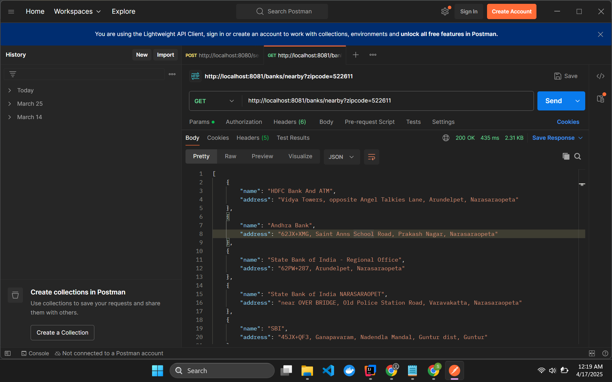

# nearby-bank-finder

## Overview
This app takes zipcode as request parameter and returns a json response of nearby banks within 10mile radius
---

## Table of Contents

1. [Step 1: Preparation](#step-1-preparation)
2. [Step 2: Setup](#step-2-setup)
3. [Step 3: Execution](#step-3-execution)
4. [Step 4: Output](#step-4-output)

---

## Step 1: Preparation

### Subheading 1.1: Gather Required Tools
Before beginning, make sure you have the following items ready:
- Get an api-key from here: https://developers.google.com/maps/documentation/embed/get-api-key#console

---

## Step 2: Setup

###
Clone this repo and use intellij

## Step 3: Execution

### Run the maps-service followed by bank-service as Springboot App

### Use postman or browser and hit the API as showing in the output images

## Step 4: Output

## Conclusion
Congratulations! You've successfully completed the process.
---